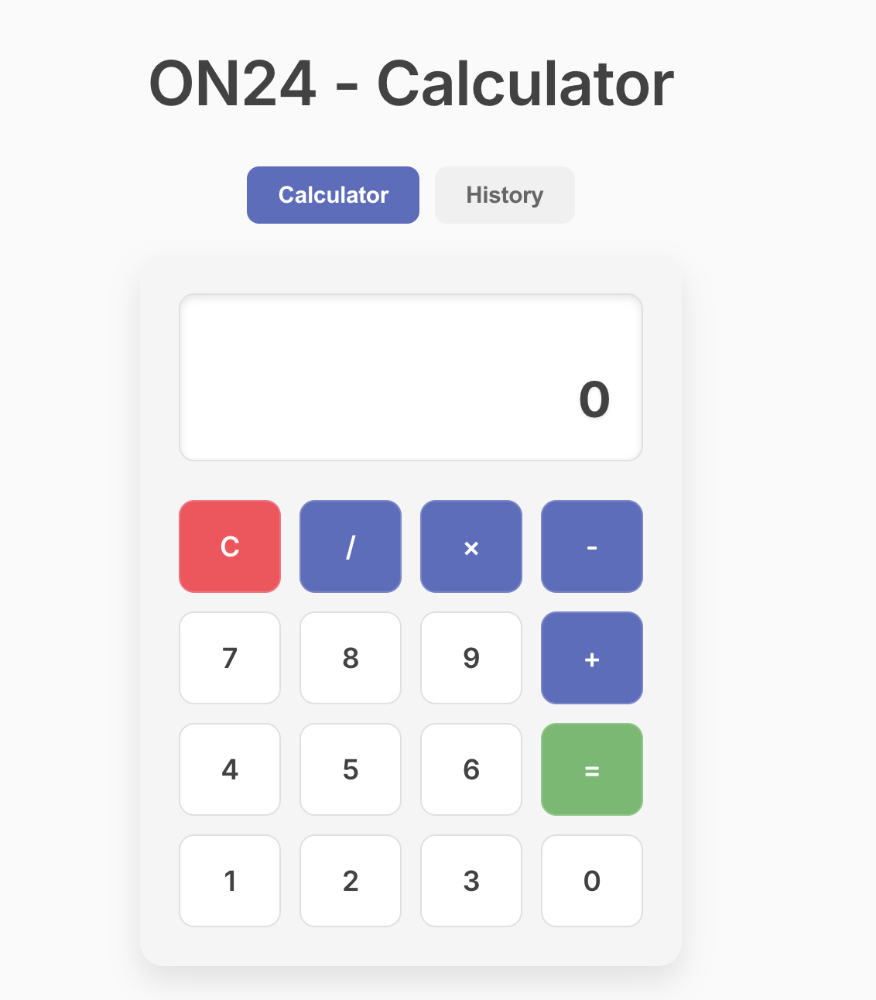

# React Calculator App

A modern calculator application built with React, featuring a clean design and calculation history. This project demonstrates React best practices, modular components, and a custom webpack configuration.

## Features

- Basic arithmetic operations (+, -, ×, ÷)
- Clean, modern UI with smooth animations
- Calculation history view
- Responsive design
- Custom webpack and babel configuration
- CSS Modules with PostCSS

## Tech Stack

- React (Functional Components & Hooks)
- Webpack 5
- Babel
- PostCSS
- CSS Modules
- Express (Development Server)
- Node.js

## Project Structure

src/
├── components/
│ ├── Calculator/
│ │ ├── index.js
│ │ ├── Calculator.js
│ │ ├── Calculator.css
│ │ └── constants.js
│ ├── History/
│ │ ├── index.js
│ │ ├── History.js
│ │ └── History.css
│ └── ViewSwitch/
│ ├── index.js
│ ├── ViewSwitch.js
│ ├── ViewSwitch.css
│ └── constants.js
├── App.js
├── index.js
├── index.html
└── index.css

## Installation

1. Clone the repository
2. Run `npm install` to install dependencies
3. Run `npm run dev` to start the development server
